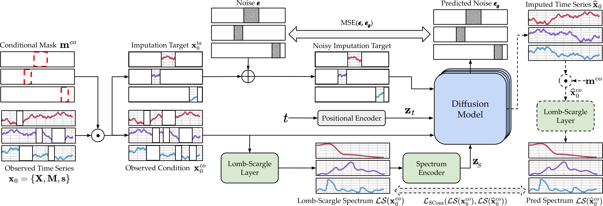

# LSCD
This is the github repository for the 2025 paper "LSCD: Lomb--Scargle Conditioned Diffusion for Irregular Time series Imputation".




## Requirement

Please install the packages in requirements.txt

## Preparation
### Download the physionet dataset 
```shell
python download.py physio
```
### Download the air quality PM2.5 dataset 
```shell
python download.py pm25
```

## Experiments 

### training and imputation for the physionet dataset
```shell
python exe_physio.py --model [csdi/lscd] --seed 1 --wandb_name [wandb project name] --epochs 400 --ls_log --ls_nheads 8 --ls_nlayers 4 --ls_channels 64 --nfold 0 --testmissingratio [missing ratio]
```

### training and imputation for the PM2.5 dataset
```shell
python exe_pm25.py --model [csdi/lscd] --seed 1 --wandb_name [wandb project name] --epochs 400 --ls_log --ls_nheads 8 --ls_nlayers 4 --ls_channels 64 --nfold 0 --testmissingratio [missing ratio]
```

### training and imputation for the sines dataset
```shell
python exe_sines.py --model [csdi/lscd] --seed 1 --wandb_name [wandb project name] --epochs 400 --ls_log --ls_nheads 8 --ls_nlayers 4 --ls_channels 64 --nfold 0 --testmissingratio [missing ratio] --missing_type [point, seq or block]
```
